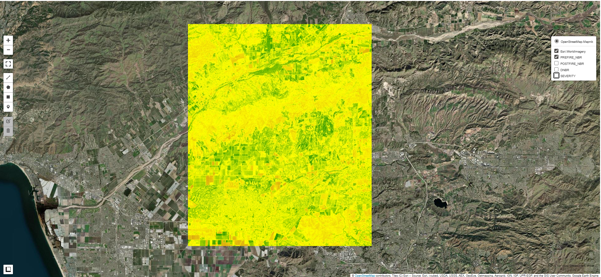
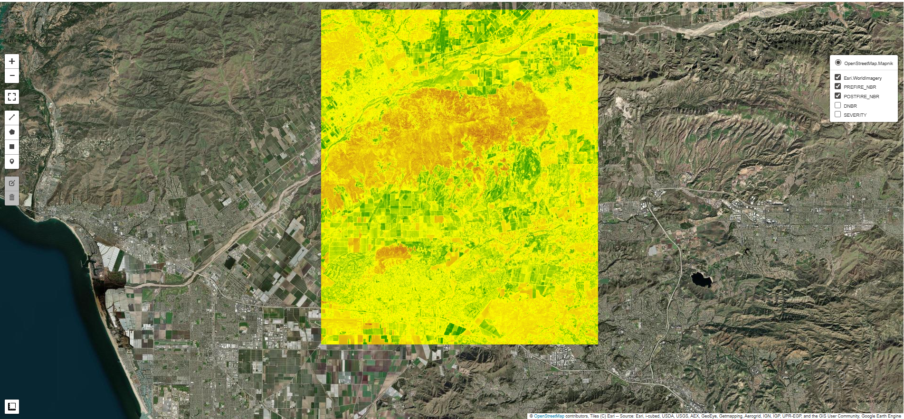

# 🔥 Wildfire Burn Severity Analysis

A Python-based wildfire burn severity analysis tool using Google Earth Engine and Sentinel-2 satellite imagery. This project analyzes burn severity using the dNBR (differenced Normalized Burn Ratio) method and generates interactive visualizations.


## 🌟 Features

- **Automated Burn Severity Analysis** - Uses dNBR classification to categorize burn severity into 5 levels
- **Interactive Map Dashboard** - Visualize pre-fire, post-fire, and burn severity data
- **Sentinel-2 Integration** - Processes high-resolution satellite imagery with cloud filtering
- **Customizable Study Areas** - Define your own region of interest using bounding boxes
- **HTML Export** - Generates beautiful, interactive HTML dashboards

## 📊 Output Example

The tool generates an interactive dashboard showing:
- Pre-fire NBR (Normalized Burn Ratio)
- Post-fire NBR
- dNBR (difference)
- Burn severity classification with color-coded legend

**Severity Categories:**
- 🟢 Unburned (dNBR < 0.05)
- 🟡 Low Severity (0.05 - 0.27)
- 🟠 Moderate-Low (0.27 - 0.44)
- 🔴 Moderate-High (0.44 - 0.66)
- 🔴 High Severity (> 0.66)

## 📸 Preview

Below is a preview of the wildfire burn severity dashboard generated by this project.

** Prefire


** Postfire


*Severity


## 🛠️ Technologies Used

- **Python 3.8+**
- **Google Earth Engine API** - Satellite data processing
- **geemap** - Interactive mapping
- **Sentinel-2 Level-2A** - Surface reflectance imagery

## 📋 Prerequisites

1. **Google Earth Engine Account**
   - Sign up at [earthengine.google.com](https://earthengine.google.com/)
   - Create a project and note your project ID

2. **Python Environment**
   ```bash
   pip install earthengine-api geemap
   ```

3. **Authentication**
   ```bash
   earthengine authenticate
   ```

## 🚀 Getting Started

1. **Clone the repository**
   ```bash
   git clone https://github.com/danso60/Forest_Wildfire_dnbr.git
   cd wildfire-burn-severity
   ```

2. **Install dependencies**
   ```bash
   pip install -r requirements.txt
   ```

3. **Configure your analysis**
   
   Edit the configuration section in the script:
   ```python
   EE_PROJECT = "your-project-id"
   REGION_NAME = "YourRegion"
   BBOX = [min_lon, min_lat, max_lon, max_lat]
   PRE_FIRE_START = "2024-10-01"
   PRE_FIRE_DATE = "2024-11-06"
   POST_FIRE_START = "2024-12-01"
   POST_FIRE_DATE = "2024-12-31"
   ```

4. **Run the analysis**
   ```bash
   python wildfire_analysis.py
   ```

5. **View results**
   
   Open the generated HTML files in `outputs/`:
   - `wildfire_dashboard_[REGION_NAME].html` - Main dashboard
   - `map_[REGION_NAME].html` - Interactive map

## 📁 Project Structure

```
wildfire-burn-severity/
├──src
|   ├── wildfire_analysis.py     # Main analysis script
├── outputs/                   # Generated maps and dashboards
│   ├── map_*.html
│   └── wildfire_dashboard_*.html
├── requirements.txt           # Python dependencies
└── README.md
```

## 🔧 Configuration Options

| Parameter | Description | Example |
|-----------|-------------|---------|
| `REGION_NAME` | Name of study area | "Camarillo" |
| `BBOX` | Bounding box [min_lon, min_lat, max_lon, max_lat] | [-119.1, 34.2, -118.9, 34.4] |
| `PRE_FIRE_START` | Start date for pre-fire imagery | "2024-10-01" |
| `PRE_FIRE_DATE` | End date for pre-fire imagery | "2024-11-06" |
| `POST_FIRE_START` | Start date for post-fire imagery | "2024-12-01" |
| `POST_FIRE_DATE` | End date for post-fire imagery | "2024-12-31" |
| `CLOUDY_PIXEL_PERCENTAGE` | Maximum cloud cover threshold | 20 |

## 📖 How It Works

1. **Data Collection** - Fetches Sentinel-2 imagery for pre- and post-fire periods
2. **Cloud Filtering** - Filters images to ensure < 20% cloud coverage
3. **Composite Creation** - Creates median composites for cloud-free images
4. **NBR Calculation** - Computes Normalized Burn Ratio using NIR and SWIR bands
5. **dNBR Analysis** - Calculates the difference between pre- and post-fire NBR
6. **Severity Classification** - Categorizes burn severity based on dNBR thresholds
7. **Visualization** - Generates interactive maps and dashboards

## 🎯 Use Cases

- Wildfire damage assessment
- Post-fire recovery monitoring
- Environmental impact studies
- Research and education
- Portfolio/skill demonstration

## ⚠️ Limitations

- Requires cloud-free or low-cloud imagery
- Resolution limited to Sentinel-2 capabilities (10-20m)
- Results depend on image availability in the study area
- May need date range adjustments for sufficient data

## 🤝 Contributing

This is a personal project for skill demonstration, but suggestions and improvements are welcome! Feel free to open an issue or submit a pull request.

## 📝 License

This project is open source and available under the MIT License.

## 🙏 Acknowledgments

- **Copernicus Sentinel-2** - Satellite imagery
- **Google Earth Engine** - Cloud computing platform
- **geemap** - Python package for interactive mapping

## 📧 Contact

Questions or feedback? Feel free to reach out or open an issue!

---

**Note:** This is a personal project created to demonstrate geospatial analysis skills with Python and Google Earth Engine.
